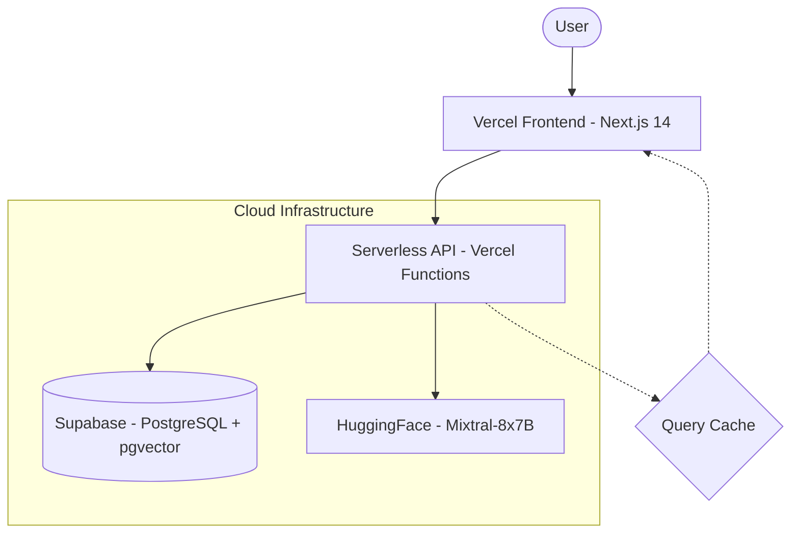

# Talk-to-Syllabus AI

> Zero-cost, serverless, scalable Generative AI system for ABES Engineering College students to query syllabus PDFs conversationally.

**Built for ABES Cloud Hackathon 2026**

---

## Architecture

```
User  ->  Vercel Frontend (Next.js 14)
         ->  Serverless API (Vercel Functions)
           ->  Supabase (PostgreSQL + pgvector)
           ->  HuggingFace Inference API (Embeddings + LLM)
         ->  Cached / AI-Generated Response
```



### Key Design Principles

- **Stateless** - No session state in memory; all state lives in the database
- **Event-driven** - Compute only runs when a request arrives
- **Cache-first** - Identical questions return cached answers instantly
- **Zero idle cost** - No VMs, no containers running when nobody's asking

---

## Tech Stack

| Layer      | Technology                                          |
| ---------- | --------------------------------------------------- |
| Frontend   | Next.js 14 (App Router), TailwindCSS, React Query   |
| Backend    | Vercel Serverless Functions (Node.js)               |
| Database   | Supabase PostgreSQL + pgvector                      |
| Embeddings | `sentence-transformers/all-MiniLM-L6-v2` (384 dims) |
| LLM        | HuggingFace Inference API (Mixtral-8x7B)            |
| Storage    | Supabase Storage                                    |
| Deployment | Vercel (auto-scaling, edge network)                 |

---

## Features

### Student Features

- Select course and ask any syllabus question
- AI-powered contextual answers with source references
- Three answer modes: **Simple**, **Exam-ready**, **Summary**
- Cached responses for instant repeat answers
- View exact syllabus chunks used to generate answers

### Admin Features

- Upload syllabus PDFs with drag-and-drop
- Automatic text extraction -> chunking -> embedding pipeline
- Processing status tracking

---

## Cost Breakdown: INR0

| Service     | Tier                              | Cost     |
| ----------- | --------------------------------- | -------- |
| Vercel      | Hobby (free)                      | INR0     |
| Supabase    | Free tier (500MB DB, 1GB storage) | INR0     |
| HuggingFace | Free Inference API                | INR0     |
| **Total**   |                                   | **INR0** |

---

## Setup & Development

### Prerequisites

- Node.js 18+
- Supabase account (free tier)
- HuggingFace account (free API key)

### 1. Clone & Install

```bash
git clone <your-repo-url>
cd rag-cloud-hack
npm install
```

### 2. Configure Environment

```bash
cp .env.example .env.local
# Edit .env.local with your keys
```

### 3. Setup Supabase

1. Create a new Supabase project
2. Go to SQL Editor -> Run the contents of `supabase/schema.sql`
3. Create a Storage bucket named `syllabus-pdfs`
4. Copy your project URL, anon key, and service role key to `.env.local`

### 4. Get HuggingFace API Key

1. Go to [huggingface.co/settings/tokens](https://huggingface.co/settings/tokens)
2. Create a new token with `read` access
3. Add it to `.env.local`

### 5. Run Locally

```bash
npm run dev
```

Open [http://localhost:3000](http://localhost:3000)

## Scalability Design

```
800+ concurrent users  ->  Vercel auto-scales functions
                       ->  Supabase connection pooling
                       ->  Query caching reduces LLM calls by ~60%
                       ->  Stateless API = infinite horizontal scaling
```

- **Cold start**: ~1-2s (mitigated by Vercel's edge network)
- **Cached response**: < 200ms
- **Fresh LLM response**: 2-5s
- **Embedding generation**: ~100ms per query

---

## How RAG Works

1. **Ingestion**: PDF -> Extract text -> Split into chunks -> Generate embeddings -> Store in pgvector
2. **Query**: Question -> Generate embedding -> Vector similarity search -> Top 5 chunks -> Build context prompt -> LLM generates answer
3. **Cache**: Hash(question + course + mode) -> If exists, return cached -> Saves LLM costs

---

## Innovation Features

- **Exam Mode**: Structured, exam-ready formatted answers
- **Summary Mode**: 5 key bullet points for quick revision
- **Source Transparency**: Every answer shows which syllabus chunks were used
- **Query Caching**: Identical questions get instant responses (0 LLM cost)
- **Analytics Ready**: Every query is logged for pattern analysis

---

## Project Structure

```
src/
 app/
    api/
       query/route.ts       # RAG query pipeline
       upload/route.ts      # PDF ingestion pipeline
       upload/status/route.ts
       courses/route.ts
    admin/page.tsx           # Admin upload UI
    layout.tsx               # Root layout
    page.tsx                 # Student chat UI
    globals.css
 components/
    chat-bubble.tsx
    chat-interface.tsx
    course-selector.tsx
    file-uploader.tsx
    footer.tsx
    header.tsx
    mode-toggle.tsx
    providers.tsx
    source-accordion.tsx
 lib/
    cache.ts                 # Query caching with SHA256 hash
    embeddings.ts            # HuggingFace embedding generation
    llm.ts                   # LLM prompt engineering & generation
    pdf.ts                   # PDF extraction & chunking
    supabase.ts              # Supabase client
    utils.ts
 supabase/
     schema.sql               # Database schema with pgvector
```

---

## Team

Built by 0xalgos team: Dheershika, Mansi, Manvendra, Anand

---

_"We designed a stateless, serverless RAG architecture that eliminates idle cost and scales horizontally by design. Embeddings are precomputed, inference is minimized via caching, and all compute is event-driven."_
